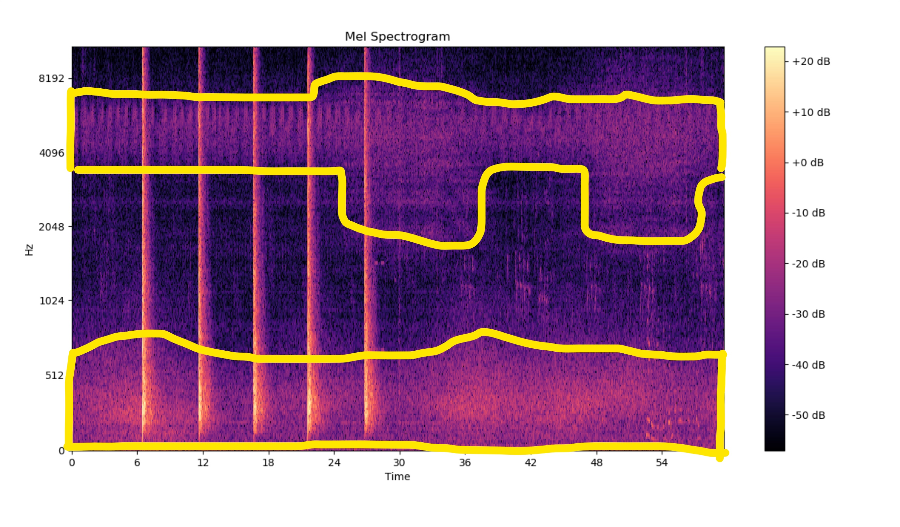

# 🎶 Audio Signal Processing
> Code by Pin-Yen(Jason) Huang aka PM
*** 

## [ Example Audio Graph ]

 
### Spectrogram after normalize and noise remove

 
### Onset & Offset Detection

# Workflow

 
Audio files usually contain lots of background noises, which can greatly affect computers to make decisions like onset and offset detections. So the first things I do is trying to wipe out the noise from the original signal.

The spectrogram of the sample audio is show in graph 1 down below and background noises is something looks in graph 2.  

### Graph 1: Spectrogram

### Graph 2: Background Noises

There's many way to extinguish background noise from the audio spectrogram. I use normalization(minus mean and divide std) to achive my purpose, which will make most of the noises value get somewhere between -1 to +1. 

Now, if I use the whole spectrogram to do the normalize, results wouldn't be that good. Because there's many different kind of noises in different frequency domain as you can see in graph 2 above. So to make a better results I should horizontaly slice the spectrogram into many part and apply normalization separately. 

